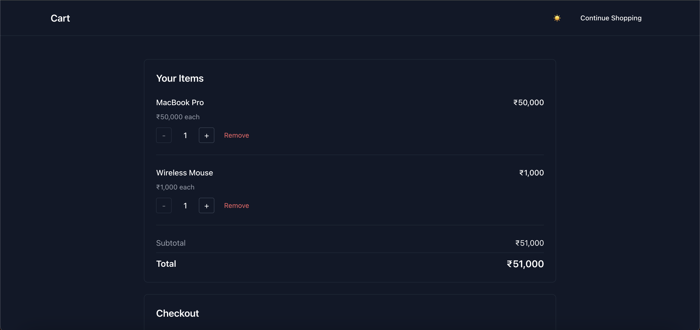
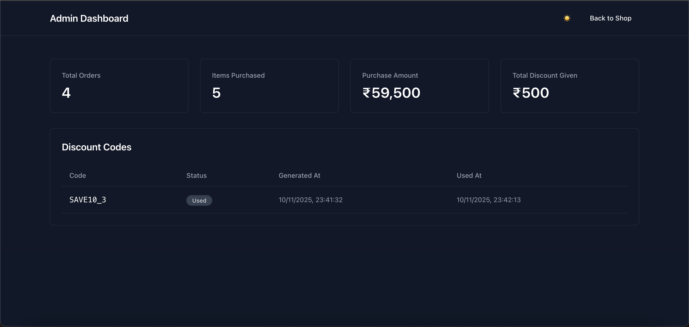

# Customer Cart System

A simple e-commerce shopping cart system with discount code functionality built with Next.js, TypeScript, and Tailwind CSS.

## Features

- 🛒 Shopping cart with add to cart functionality
- 💳 Checkout with discount code validation
- 🎁 Automatic discount code generation every 3rd order (10% off)
- 📊 Admin dashboard with statistics
- 💾 In-memory data storage
- 🌓 Light/Dark theme support

## Screenshots

### Products Page


### Shopping Cart


### Admin Dashboard


## Tech Stack

- Next.js 16
- React 19
- TypeScript
- Tailwind CSS v4
- next-themes
- Jest + React Testing Library

## Setup Instructions

1. Install dependencies:
```bash
npm install
```

2. Run the development server:
```bash
npm run dev
```

3. Open [http://localhost:3000](http://localhost:3000) in your browser

## Project Structure

```
src/
├── app/
│   ├── page.tsx           # Products listing page
│   ├── cart/
│   │   └── page.tsx       # Cart and checkout page
│   ├── admin/
│   │   └── page.tsx       # Admin dashboard
│   └── api/
│       ├── cart/
│       │   └── route.ts   # Cart API (GET, POST)
│       ├── checkout/
│       │   └── route.ts   # Checkout API (POST)
│       └── admin/
│           └── stats/
│               └── route.ts  # Admin stats API (GET)
└── lib/
    └── store.ts           # In-memory data store
```

## Usage

### Shopping Flow

1. Browse products on the home page
2. Click "Add to Cart" to add items
3. Click "Cart" to view your cart
4. Enter discount code (if available)
5. Click "Place Order" to checkout

### Discount Codes

- Generated automatically on every 3rd order
- Format: `SAVE10_3`, `SAVE10_6`, `SAVE10_9`, etc.
- Provides 10% discount on total order
- Can only be used once

### Admin Dashboard

- View total orders count
- View total items purchased
- View total purchase amount
- View total discount given
- See all discount codes with their status

## API Endpoints

### Customer APIs

- `GET /api/cart` - Get current cart
- `POST /api/cart` - Add item to cart
  ```json
  { "productId": 1, "quantity": 1 }
  ```
- `PATCH /api/cart` - Update item quantity
  ```json
  { "productId": 1, "quantity": 3 }
  ```
- `DELETE /api/cart` - Remove item from cart
  ```json
  { "productId": 1 }
  ```
- `GET /api/coupons` - Get available discount codes
- `POST /api/checkout` - Place order
  ```json
  { "discountCode": "SAVE10_3" }
  ```

### Admin APIs

- `GET /api/admin/stats` - Get statistics

## Edge Cases Handled

- Empty cart checkout prevention
- Invalid product ID validation
- Quantity validation (must be >= 1)
- Invalid discount code handling
- Already used discount code handling
- Discount code generation on every 3rd order

## Testing

Run tests with:
```bash
npm test
```

Run tests in watch mode:
```bash
npm run test:watch
```

**Test Coverage:**
- 67 tests across 5 test suites
- Store logic tests (33 tests)
- Cart API tests (11 tests)
- Checkout API tests (8 tests)
- Coupons API tests (4 tests)
- Admin Stats API tests (7 tests)

## Build

To create a production build:
```bash
npm run build
npm start
```

## Notes

- All data is stored in-memory and will be lost on server restart
- No authentication/authorization implemented
- Single user cart system
- Pre-defined product catalog with 5 products
